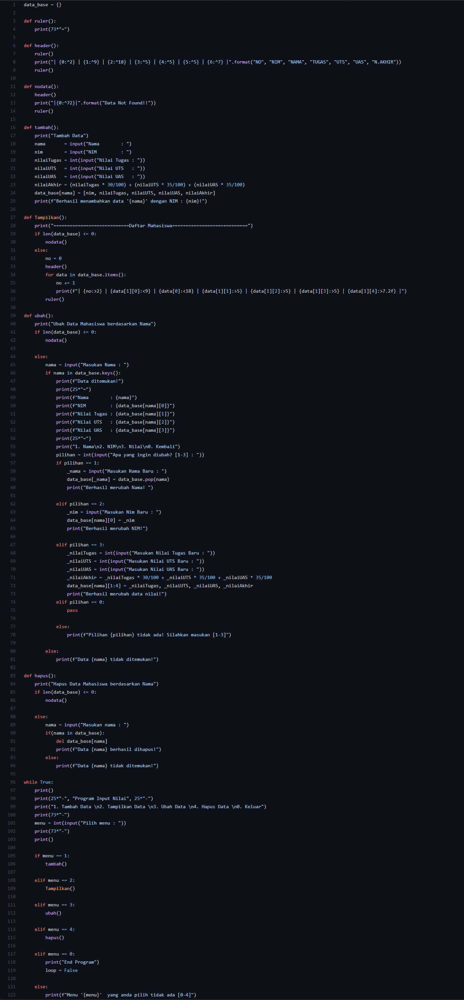
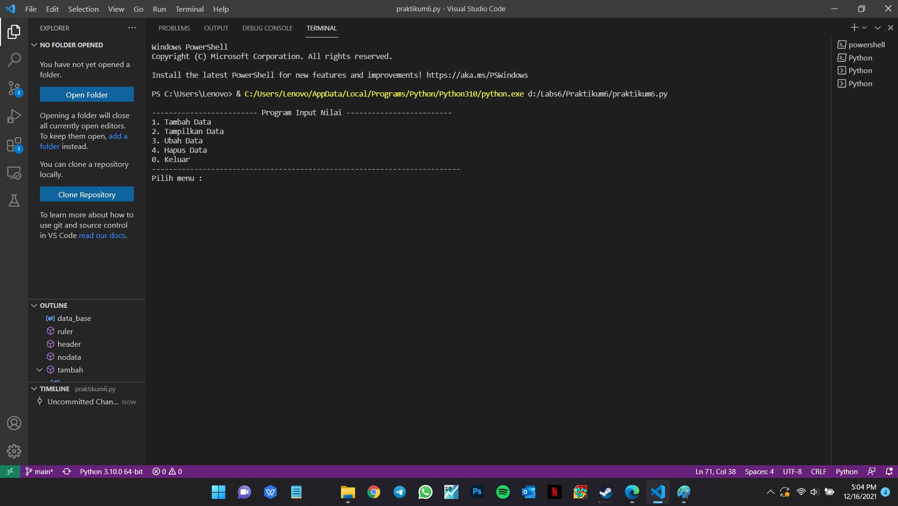
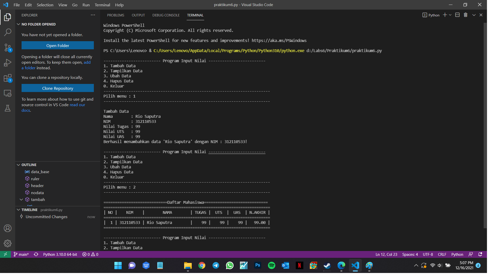

# Praktikum6

## Source Code

## Penjelasan Program Penggunaan Fungsi

1.Deklarasi Dictionary sebagai database

2.Membuat Function tambahan agar bisa dipanggil saat dibutuhkan

3.Membuat Function Program Function ubah() dijalankan berdasarkan nama

-Memasukan nama sebagai key dan akan memunculkan isi data dari key tersebut

-Jika salah memasukkan nama, maka akan mengeluarkan "data nama tidak ditemukan!"

-Selanjutnya akan diberi pilihan apa yang ingin diubah, jika ingin membatalkan maka ketik 0

-Jika salah memasukkan pilihan maka mengeluarkan "Pilihan input tidak ada! Silahkan masukan [1-3]"

-Menggunakan infinite loop while True

-Apabila salah memasukkkan inputan maka akan muncul "Menu 'menu' tidak ada!"

-Jika benar maka function yang sudah dibuat akan dijalankan

## Tampilan output program fungsi

## Tampilan Nilai Program fungsi
